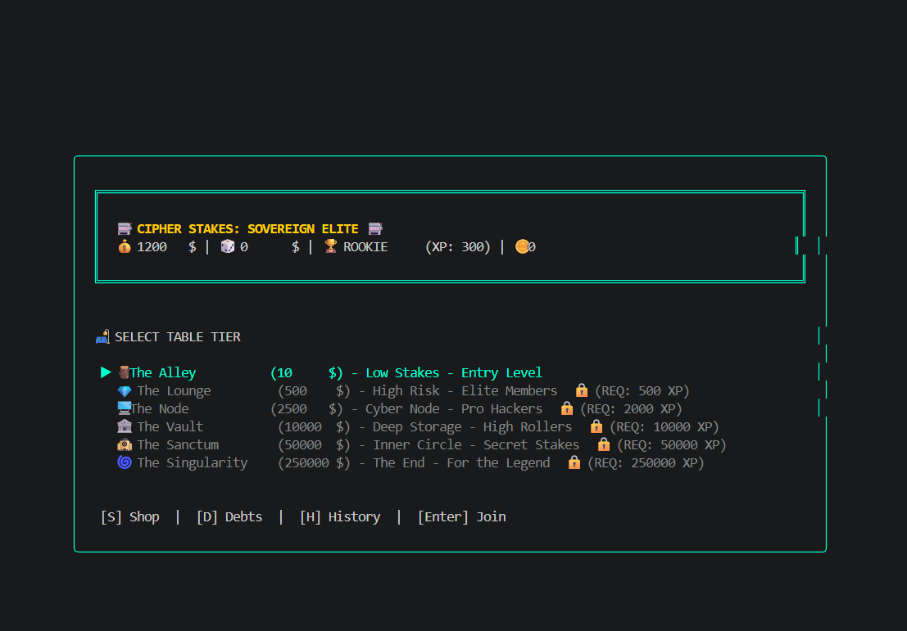
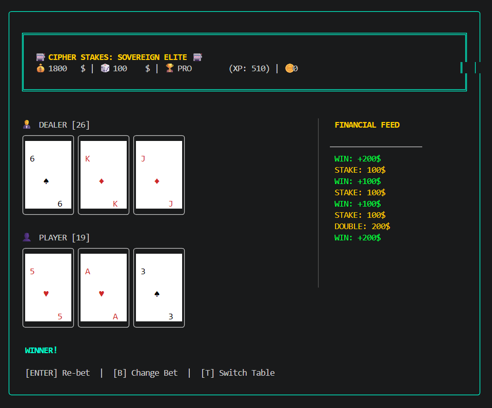

# 🎰 Cipher21: Sovereign Elite Protocol


**Cipher21** is a high-performance, terminal-native Blackjack simulation engineered for those who demand **cryptographic transparency** and a sleek, distraction-free environment. 

---

## 📥 [CLICK HERE TO DOWNLOAD CIPHER21.ZIP (LATEST)](https://github.com/GIN-SYSTEMS/Cipher21/releases/latest)
> *Instant deployment. No installation required. Just extract and run.*

---

## 📸 Interface Showcase

Cipher21 utilizes a sophisticated Terminal UI (TUI) to provide a premium casino experience within your command prompt.

<p align="center">
  
  
</p>
<p align="center">
  <em>Left: Tier Selection Protocol. Right: High-Stakes Gameplay with Live Financial Feed.</em>
</p>

---

## 🛡️ Security & Transparency (False Positive Notice)

Cipher21 is fully **open-source**. You can audit every line of the code in this repository. 

* **VirusTotal Status:** Some heuristic scanners (like Bkav or DeepInstinct) may flag the `.exe` as suspicious. This is a common **False Positive** for Go binaries that lack an expensive commercial digital signature.
* **Integrity:** The application does not require administrator privileges and only interacts with its local `.db` file.
* **Trust:** If you prefer not to run the pre-compiled binary, you can easily **build from source** using the instructions below.

---

## ⚡ Core Protocol Features

### 🔐 Provably Fair (SHA-256)
Every deck is shuffled and sealed with a **SHA-256 hash** before the first card is dealt. Users can verify the deck integrity post-game to ensure the dealer hasn't manipulated the cards.

### 💹 Real-Time Financial Feed
The dashboard features a dynamic sidebar that tracks every transaction, double-down, and payout with sub-second latency—giving you the precision of a professional trading terminal.

### 🏆 Tiered Progression
Move through 6 distinct tiers, from **The Alley** (low stakes) to **The Singularity** (high-multiplier end-game), unlocking new levels as your XP grows.

---

## 🎮 Navigation Controls

| Key | Function |
| :--- | :--- |
| **↑ / ↓** | Adjust Stakes / Select Table |
| **ENTER** | Hit / Confirm / Start |
| **[M]** | **Max Bet:** Commit full balance (All-in) |
| **[H]** | **History:** View session logs |
| **[D]** | **Debt:** Manage loans and repayments |
| **[S]** | **Shop:** Purchase Lucky Coins |
| **[Q]** | **Quit:** Secure database sync and exit |

---

## 🛠️ Installation & Build

### Windows Execution
1. Download the `Cipher21.zip` from [Releases](https://github.com/GIN-SYSTEMS/Cipher21/releases).
2. Extract the archive.
3. Run `Cipher21.exe`. For the best experience, use **Windows Terminal**.

### Manual Compilation (Go 1.20+)
```bash
git clone [https://github.com/GIN-SYSTEMS/Cipher21.git](https://github.com/GIN-SYSTEMS/Cipher21.git)
go mod tidy
go build -ldflags="-s -w" -o Cipher21.exe main.go
